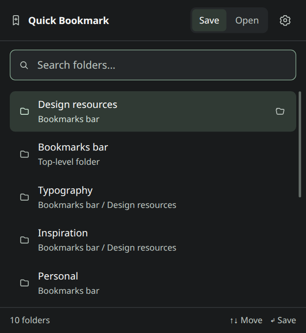

# Quick Bookmark

Quickly bookmark a page or open a bookmarked page via fuzzy search.

- `Ctrl + D` to bookmark a page.
- `Alt + F` to open a bookmarked page (`Ctrl + Enter` to open in new tab and `Ctrl + Shift + Enter` to open in new tab at end of all tabs).
- On a supported YouTube video page, `Ctrl + D` opens a YouTube playlist picker instead of the folder picker.
- While the popup is open on a YouTube video, pressing `Ctrl + D` again toggles between playlist mode and the normal bookmark-folder mode.
- Use the **Save**, **Open**, and (on YouTube videos) **Playlists** buttons to switch views with the mouse. Keyboard hints and result counts appear below the results.
- Frequently used bookmark folders appear first, with recent use breaking ties.
- Playlist rows show whether the video is already added and explicitly offer **Add** or **Remove**. Failed membership checks offer **Retry** without changing the playlist.

May have to set shortcuts manually in Chrome extension settings: `chrome://extensions/shortcuts`

## Settings

Click the gear in the popup, or open **Extension options** from Chrome's extension menu.

**Include URLs and domains** is **off by default**. Bookmark search matches titles until you enable it. When enabled, it also matches domains and full URLs, including paths. Changes save automatically on this browser profile and apply to an open picker.

Folder usage is stored locally and counts successful bookmark saves only. Search queries still rank by text relevance.

## YouTube playlist setup

### For normal users

You do **not** need an options page just to sign in.

The intended auth flow is:

1. Open a YouTube video page.
2. Press `Ctrl + D`.
3. Click **Connect YouTube** in the playlist picker.
4. Sign in to Google and approve access.
5. Pick a playlist.

After that, the extension can load your playlists and add or remove the current video. Rows are disabled while membership is being checked. The chosen action is rechecked before it runs: **Add** never removes an existing video, and **Remove** never adds a missing video.

Use **Refresh** to pick up playlist changes or **Reconnect** if authorization needs to be renewed. An account with no playlists is prompted to create one in YouTube.

### For the developer / unpacked build

To enable the YouTube playlist feature for real playlists on your account during development:

1. Create a Chrome Extension OAuth client in Google Cloud for this extension.
2. Put the client ID into `.env` as `VITE_YOUTUBE_CLIENT_ID`.
3. Optional but recommended: add your extension public key as `VITE_EXTENSION_KEY` so the unpacked extension keeps a stable ID.
4. Rebuild the extension and reload it in Chrome.

If YouTube OAuth is not configured yet, the playlist picker explains that YouTube is unavailable in this build. Normal bookmarking remains available with `Ctrl + D`.

## Building a distributable zip

To create a release zip for Chrome Web Store submission:

1. Run `npm run build:release`
2. Upload the generated `quick-bookmark-<version>.zip`

The Node-based packager writes a real ZIP with forward-slash paths on Windows, macOS, and Linux. It checks manifest versions and required files before replacing the previous archive. No external archive command is needed.

The [4.0.0 publishing kit](release-files/4.0.0/PUBLISHING.md) includes store copy, permission explanations, reviewer instructions, and updated listing images. Download the extension ZIP and publishing-kit ZIP from the [GitHub release](https://github.com/DovieW/quick-bookmark/releases/tag/v4.0.0). See [CHANGELOG.md](CHANGELOG.md) for the changes.

To regenerate the kit after building, run `npm run store:images`, `npm run package:zip`, and `npm run package:kit`. Store screenshots use fictional bookmarks and mocked playlist data in a temporary browser profile.

## Development and checks

Use Node.js 22 or newer. Install dependencies with `npm ci`.

- `npm run typecheck` checks the application, build config, and tests.
- `npm run test:unit` checks search defaults, ranking, settings persistence, YouTube action intent, and ZIP contents.
- `npx playwright install chromium` installs the browser used by UI checks.
- `npm run test:ui` builds the extension, tests keyboard and error flows with mocked Chrome/YouTube APIs, and loads the packaged extension in a temporary Chromium profile to check real settings and bookmark APIs.
- `npm test` runs all checks. `npm run build` also requires type checking to pass.

Browser tests use synthetic bookmarks and mocked YouTube responses; they do not connect to your Google account. Membership lookups use the [YouTube API's video filter](https://developers.google.com/youtube/v3/docs/playlistItems/list#videoId) rather than scanning every video in a playlist.

[Chrome Store](https://chromewebstore.google.com/detail/quick-bookmark/diadedbbnkkjdmldbnfiohjomifmghbi)
